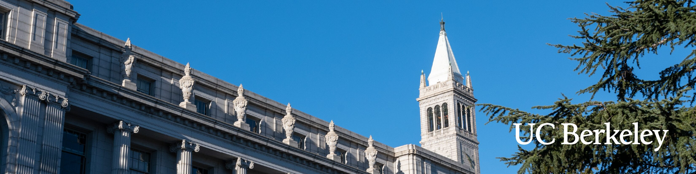

  

# Kurt Soncco Sinchi's PhD Research Portfolio

Welcome! I am a PhD Candidate in the `Department of Civil and Environmental ENgineering` at the **University of California, Berkeley**, advised by Professor Mohamad Hallal.

My research, situated at the intersection of `Geotechnical Engineering` and `Machine Learning`, focuses on `robust surrogated earthquate physical simulators and probabilsitic spatial correlated generation of site analysis`. This repository serves as a central portfolio connecting the various research projects I am leading or contributing to during my doctoral studies, as well as collaboration I have been part of!

  
  
  

---

## Interactive Research Projects

My full list of research projects is below.

<!-- PROJECT_LIST -->

<!-- END_PROJECT_LIST -->

Each project is maintained in its own repository, which includes the source code, documentation, and (where possible) data and instructions required for reproduction, embodying my commitment to open and reproducible science.

---

Feel free to reach out with any questions or potential collaborations. Go Bears! 🐻
